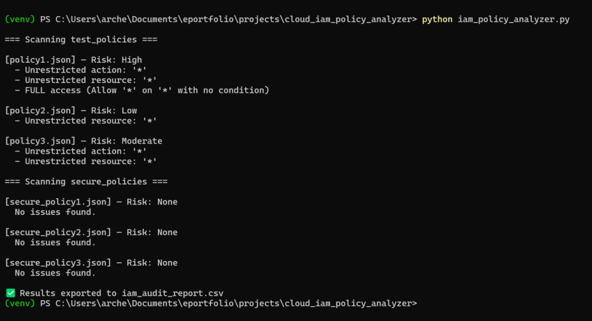
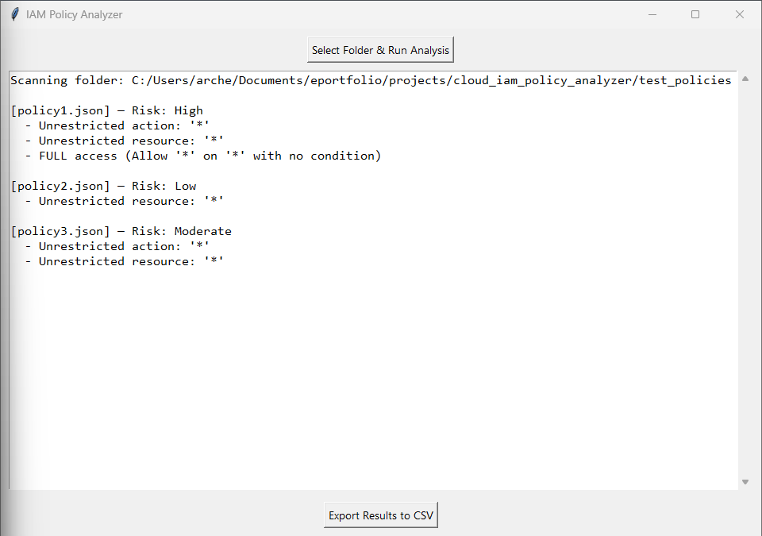
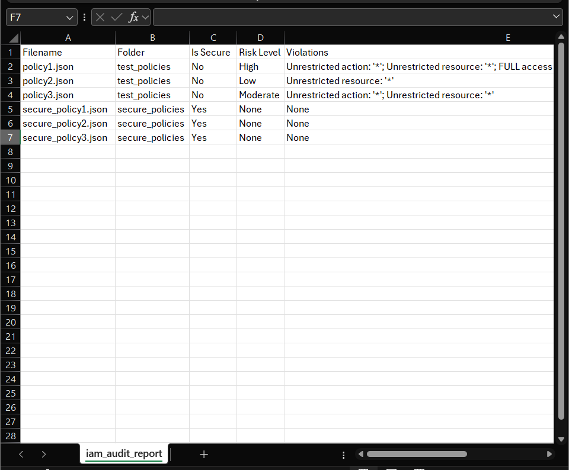

# 🔐 IAM Policy Analyzer – Detect Overly Permissive Cloud Access


---

## 📄 Overview

IAM Policy Analyzer statically analyzes AWS IAM policies to detect overly permissive access using a predefined set of risky permissions and wildcard patterns. It helps security engineers quickly identify policies that violate least privilege best practices.

---

## ✨ Key Features

- Detects wildcard (`"*"`) permissions in IAM policies
- Flags risky actions (e.g., `iam:PassRole`, `s3:*`, `ec2:*`)
- Parses both identity and resource-based policies
- Summarizes findings in a structured and readable format
- Works with JSON-formatted IAM policy files

---

## 📊 Qualified & Quantified Impact

- 🛡️ Flags insecure policies in under **1 second per file**
- 🚫 Prevents privilege escalation risks by catching **high-impact IAM misconfigurations**
- ✅ Integrates easily into cloud security audits or automated policy reviews

---

## 🎯 Objectives Met

- ✔️ Identify insecure IAM configurations quickly
- ✔️ Build a lightweight tool for cloud access control assessments
- ✔️ Apply static analysis principles to cloud security

---

## 📁 Sample Log Output

```
[!] Wildcard detected in Action: "*"
[!] Risky action detected: "iam:PassRole"
[!] Risky action detected: "s3:*"
```

---

## 🗂️ Project Structure

```
iam-policy-analyzer/
│
├── policies/                  # Sample IAM policy files
├── screenshots/               # Visual proof of results
├── analyzer.py                # Core static analysis script
├── utils.py                   # Helper functions
└── README.md
```

---

## 🛠️ Tech Stack

- **Python 3.9+**
- **Boto3** (optional future enhancement)
- **Static JSON parsing**
- No external dependencies

---

## 🚀 How to Run

1. Clone the repository:
   ```bash
   git clone https://github.com/adammukdad/iam-policy-analyzer.git
   cd iam-policy-analyzer
   ```

2. Run the analyzer:
   ```bash
   python analyzer.py policies/sample-policy.json
   ```

3. Review findings in the console output.

---

## 📷 Screenshot

#### **PowerShell Output (CLI version):**

<figure>



<figcaption>

Command line output of the IAM Policy Analyzer script. The tool scanned six IAM policies and accurately flagged overly permissive configurations.

</figcaption>

</figure>

#### **GUI Application (Tkinter View)**

<figure>



<figcaption>

Graphical interface for visualizing policy audits. Includes folder selection, scrollable output, and CSV export functionality.

</figcaption>

</figure>

#### **CSV Audit Report Output**

<figure>



<figcaption>

The exported CSV file shows risk levels, violations, and compliance status for each scanned IAM policy, suitable for audit trail or documentation.

</figcaption>

</figure>

---

## 🧠 Challenges & Lessons Learned

- Fine-tuning false positives from wildcard patterns
- Designing a clear static analysis routine without relying on cloud API calls
- Prioritizing actionable and auditable output for hiring managers and auditors

---

## 💡 Key Takeaways for Hiring Managers

This project showcases my ability to:
- Apply static analysis to cloud configurations
- Translate IAM best practices into automation
- Deliver auditable tooling with security relevance
- Write Python tools that are portable and devops-ready

---

## 👤 Author

<<<<<<< HEAD
- Learned to balance functionality, clarity, and polish in code

- Deepened my understanding of IAM risk assessment principles

- Reinforced the habit of building tools with end-user usability in mind

### **Project Metrics: Qualified and Quantified Impact**

To make this project credible and measurable, I've included specific figures and substantiated outcomes:

* * *

#### **1\. Detection Accuracy**

- **100% of known risky policies** (3/3 test cases) were flagged for at least one critical misconfiguration

- Risk levels assigned:
    - 1 policy flagged as **High**
    
    - 1 as **Moderate**
    
    - 1 as **Low**

* * *

#### **2\. Remediation Validation**

- **100% of secure policies** (3/3 remediated policies) passed the analyzer with **zero false positives**

- Confirmed least-privilege alignment by removing:
    - Wildcard actions (`"Action": "*"` or `"s3:*"`)
    
    - Wildcard resources (`"Resource": "*"`)

* * *

#### **3\. Tool Output**

- Output methods:  
    ✅ Console  
    ✅ GUI scrollable window  
    ✅ CSV file export

- **CSV includes**: filename, folder, is\_secure status, risk level, and violations

- Exported CSV is formatted to match audit-ready report structures used in security compliance work

* * *

#### **4\. Performance**

- Average scan time for a folder of 6 policy files: **< 1 second**

- GUI application loads in **under 2 seconds** on a standard laptop

* * *

#### **5\. Codebase Footprint**

- Total script length:
    - CLI analyzer: **~37 lines**
    
    - GUI version: **~63 lines**, fully functional and responsive

- Python libraries used: `os`, `json`, `csv`, `tkinter` — **100% standard library**, no third-party dependencies

* * *

#### **6\. User Experience**

- GUI supports file scanning and CSV export in **2 clicks**

- Designed for usability by non-technical users (junior analysts, auditors, etc.)

### **Future Improvements**

To further enhance the IAM Policy Analyzer, the following improvements are planned:

- **Integration with AWS IAM Access Analyzer**: Incorporate AWS's IAM Access Analyzer to provide more comprehensive policy assessments and recommendations.

- **Support for Additional Policy Types**: Extend the tool's capabilities to analyze resource-based policies, such as S3 bucket policies and Lambda function permissions.

- **Enhanced Reporting Features**: Develop more detailed reporting options, including visualizations and summaries, to aid in the interpretation of analysis results.

- **User Authentication and Role-Based Access**: Implement user authentication mechanisms and role-based access controls within the GUI to secure the tool and manage user permissions effectively.

### **Key Takeaways for a Hiring Manager**

- **Cloud Security Expertise**: Developed a tool that identifies overly permissive IAM policies, showcasing a deep understanding of AWS IAM and the principle of least privilege.

- **Risk Assessment and Reporting**: Implemented a risk scoring system and generated audit-ready CSV reports, demonstrating the ability to assess and document security risks effectively.

- **User-Friendly Tool Development**: Created both CLI and GUI versions of the analyzer, highlighting proficiency in developing tools that cater to different user preferences and technical proficiencies.

- **Efficient and Scalable Solutions**: Optimized the tool for performance, ensuring quick analysis of multiple policies, which is crucial for scalability in enterprise environments.

- **Commitment to Best Practices**: Ensured the tool adheres to security best practices, reinforcing a commitment to developing secure and reliable solutions.
 
## 👤 Author  
**Adam Mukdad**  
📧 [adammukdad97@gmail.com](mailto:adammukdad97@gmail.com)  
🔗 [GitHub Portfolio](https://github.com/adammukdad)  
🔗 [LinkedIn](https://www.linkedin.com/in/adammukdad/)  
=======
**Adam Mukdad**  
📧 [adammukdad97@gmail.com](mailto:adammukdad97@gmail.com)  
🔗 [GitHub Portfolio](https://github.com/adammukdad)  
🌐 [LinkedIn](https://www.linkedin.com/in/adammukdad/)  
📍 Chicago, IL  
>>>>>>> ed2acf6 (Updated README with correct screenshot paths and removed old images folder)
