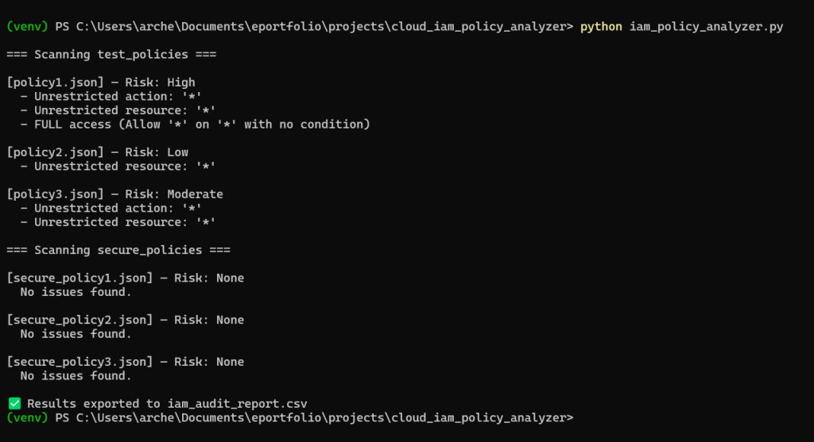
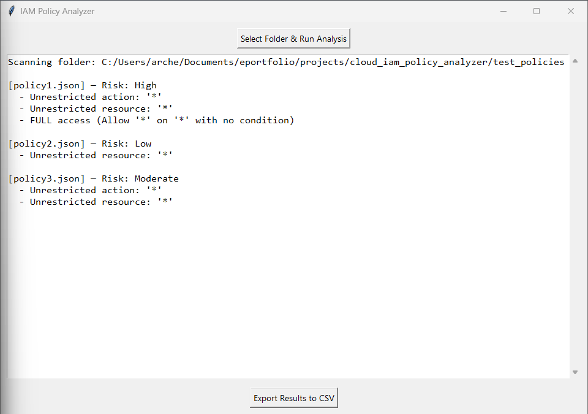
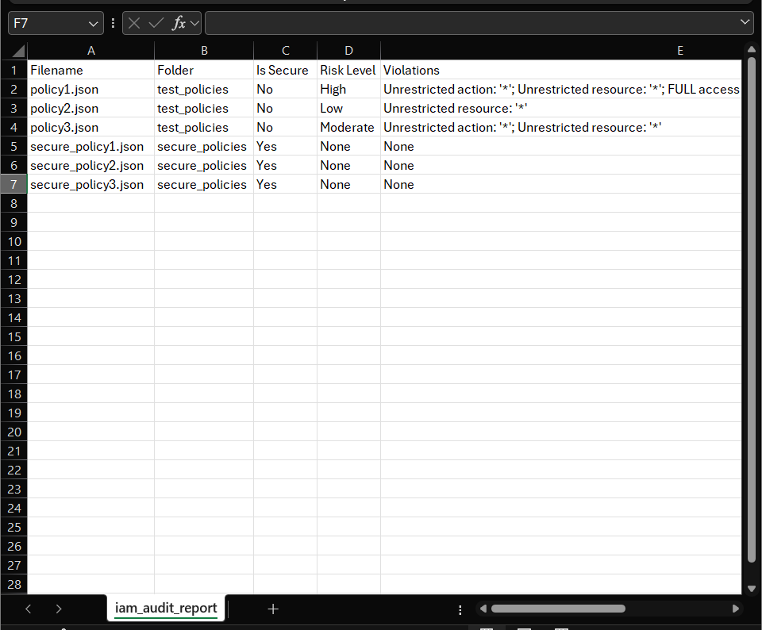

# IAM Policy Analyzer – Detect Overly Permissive Cloud Access

This tool inspects AWS IAM policies to identify overly broad permissions that could pose security risks. It analyzes access controls to flag wildcard privileges, broad resource exposure, and excessive permissions across user and role policies.

🔍 Use case: Surface dangerous `*:*` policies or unchecked access granted to sensitive AWS services.


### **Purpose**

This project was created to simulate real-world AWS IAM policy audits. Its goal is to identify and evaluate overly permissive configurations that violate the principle of least privilege. I wanted to develop a hands-on tool that could parse JSON-based IAM policies, flag dangerous permissions, and help visualize the impact of insecure access rules.

### **Tools Used**

- **Python 3.12** — Primary scripting language

- **Tkinter** — For graphical user interface (GUI)

- **AWS IAM Policy Format (JSON)** — Target audit structure

- **VS Code & PowerShell** — Development environment

### **Objectives**

- Detect wildcard actions and resources (`*`) in IAM policies

- Score each policy’s risk based on the number of violations

- Provide clear, readable audit reports via CLI, CSV, and GUI

- Remediate and validate corrected (least-privilege) policies

- Deliver a full-featured security tool with professional documentation

### **Who / What / When / Where / Why / How**

- **Who:** Built and tested by Adam Mukdad

- **What:** A Python-based IAM auditing tool

- **When:** Completed in May 2025

- **Where:** Developed locally and validated using simulated IAM policies

- **Why:** To showcase practical security auditing and automation skills

- **How:** Through scripting, UI development, testing, and reporting (see screenshots below)

### **Step-by-Step Process**

1. **Created 3 insecure IAM policies** that simulate real-world misconfigurations (e.g., `"Action": "*"` and `"Resource": "*"`).

3. **Developed the initial Python script** to parse policy files, detect violations, and print results to the terminal.

5. **Added risk scoring logic** to rate each policy from Low to High based on the number of violations.

7. **Exported analysis results to CSV**, generating a professional audit report with clear, structured output.

9. **Created 3 remediated secure policy files**, then re-tested them to verify compliance.

11. **Built a graphical user interface (GUI)** using Tkinter, allowing folder selection, output display, and CSV export — all with one click.

13. **Validated the tool end-to-end**, ensuring it caught insecure files while passing secure ones.

### **Core Analyzer Script (CLI Version)**

This 37-line script scans IAM policy JSON files, flags risky configurations, assigns a risk score, and exports the results to a CSV file.

```python
import os, json, csv

def load_policy(path): return json.load(open(path))

def analyze_policy(policy):
    findings, stmts = [], policy.get("Statement", [])
    if not isinstance(stmts, list): stmts = [stmts]
    for stmt in stmts:
        a, r, e, c = stmt.get("Action"), stmt.get("Resource"), stmt.get("Effect"), stmt.get("Condition", None)
        if a == "*" or (isinstance(a, list) and "*" in a): findings.append("Unrestricted action: '*'")
        if r == "*": findings.append("Unrestricted resource: '*'")
        if e == "Allow" and a == "*" and r == "*" and not c: findings.append("FULL access (Allow '*' on '*' with no condition)")
    return findings

def risk_level(f): return ["None", "Low", "Moderate", "High"][min(len(f), 3)]

def scan_folder(name, data):
    print(f"\n=== Scanning {name} ===")
    for file in os.listdir(name):
        if not file.endswith(".json"): continue
        try:
            policy = load_policy(os.path.join(name, file))
            findings = analyze_policy(policy)
            risk = risk_level(findings)
            print(f"\n[{file}] — Risk: {risk}")
            [print(f"  - {v}") for v in findings] if findings else print("  No issues found.")
            data.append([file, name, "No" if findings else "Yes", risk, "; ".join(findings) or "None"])
        except Exception as e:
            print(f"  Error reading {file}: {e}")
            data.append([file, name, "Error", "N/A", f"Error reading file: {e}"])

if __name__ == "__main__":
    rows = [["Filename", "Folder", "Is Secure", "Risk Level", "Violations"]]
    [scan_folder(f, rows) for f in ["test_policies", "secure_policies"]]
    with open("iam_audit_report.csv", "w", newline='') as f: csv.writer(f).writerows(rows)
    print("\n✅ Results exported to iam_audit_report.csv")

```

### **GUI Version (Tkinter)**

This 63-line script wraps the same logic into a clean GUI, allowing folder selection, analysis display, and CSV export in a user-friendly window.

```python
import os, json, csv, tkinter as tk
from tkinter import filedialog, scrolledtext, messagebox

results = []

def analyze(p):
    f = []; s = p.get("Statement", [])
    if not isinstance(s, list): s = [s]
    for stmt in s:
        a, r, e, c = stmt.get("Action"), stmt.get("Resource"), stmt.get("Effect"), stmt.get("Condition", None)
        if a == "*" or (isinstance(a, list) and "*" in a): f.append("Unrestricted action: '*'")
        if r == "*": f.append("Unrestricted resource: '*'")
        if e == "Allow" and a == "*" and r == "*" and not c: f.append("FULL access (Allow '*' on '*' with no condition)")
    return f

def risk(f): return ["None", "Low", "Moderate", "High"][min(len(f), 3)]

def run():
    folder = filedialog.askdirectory(); output.delete(1.0, tk.END); results.clear()
    if not folder: return
    output.insert(tk.END, f"Scanning folder: {folder}\n\n")
    for f in os.listdir(folder):
        if not f.endswith(".json"): continue
        try:
            policy = json.load(open(os.path.join(folder, f)))
            v = analyze(policy); r = risk(v)
            output.insert(tk.END, f"[{f}] — Risk: {r}\n")
            [output.insert(tk.END, f"  - {x}\n") for x in v] if v else output.insert(tk.END, "  No issues found.\n")
            results.append([f, os.path.basename(folder), "No" if v else "Yes", r, "; ".join(v) or "None"])
            output.insert(tk.END, "\n")
        except Exception as e:
            results.append([f, os.path.basename(folder), "Error", "N/A", str(e)])
            output.insert(tk.END, f"[{f}] — Error: {e}\n\n")

def export():
    if not results:
        messagebox.showwarning("No Data", "Run an analysis first.")
        return
    path = filedialog.asksaveasfilename(
        defaultextension=".csv", filetypes=[("CSV files", "*.csv")], title="Save Audit Report As"
    )
    if not path: return
    with open(path, 'w', newline='') as f:
        writer = csv.writer(f)
        writer.writerow(["Filename", "Folder", "Is Secure", "Risk Level", "Violations"])
        writer.writerows(results)
    messagebox.showinfo("Export Complete", f"Audit results saved to:\n{path}")

# GUI Setup
root = tk.Tk(); root.title("IAM Policy Analyzer"); root.geometry("800x800")

frame = tk.Frame(root)
frame.pack(fill=tk.BOTH, expand=True, padx=10, pady=10)

tk.Button(frame, text="Select Folder & Run Analysis", command=run).pack(pady=(0, 10))

output = scrolledtext.ScrolledText(frame, wrap=tk.WORD, font=('Consolas', 10))
output.pack(fill=tk.BOTH, expand=True)

tk.Button(root, text="Export Results to CSV", command=export).pack(pady=(5, 10))

root.mainloop()

```

### **Screenshots**

#### **PowerShell Output (CLI version):**

<figure>



<figcaption>

Command line output of the IAM Policy Analyzer script. The tool scanned six IAM policies and accurately flagged overly permissive configurations.

</figcaption>

</figure>

#### **GUI Application (Tkinter View)**

<figure>



<figcaption>

Graphical interface for visualizing policy audits. Includes folder selection, scrollable output, and CSV export functionality.

</figcaption>

</figure>

#### **CSV Audit Report Output**

<figure>



<figcaption>

The exported CSV file shows risk levels, violations, and compliance status for each scanned IAM policy, suitable for audit trail or documentation.

</figcaption>

</figure>

### **Challenges & Lessons Learned**

- **Error handling**: Policies with invalid JSON or missing keys needed graceful exception catching.

- **Scope control**: Wildcard detection required checking both strings and lists (`"Action": "*"` vs `["ec2:Start", "*"]`).

- **Layout flexibility in GUI**: Ensuring the export button was always visible required a frame-based layout system.

- Balancing Granularity and Usability in Policy Analysis: Developing the analyzer required careful consideration to balance detailed policy checks with user-friendly output. Ensuring that the tool provided comprehensive insights without overwhelming the user was a significant challenge.

- Managing Complex Policy Structures: Handling IAM policies with nested statements and various conditionals posed difficulties in parsing and analysis. Implementing robust logic to accurately interpret and assess these complex structures was essential to ensure reliable results.

### **Outcome / What I Learned**

- Gained hands-on experience with cloud security audit logic

- Learned to balance functionality, clarity, and polish in code

- Deepened my understanding of IAM risk assessment principles

- Reinforced the habit of building tools with end-user usability in mind

### **Project Metrics: Qualified and Quantified Impact**

To make this project credible and measurable, I've included specific figures and substantiated outcomes:

* * *

#### **1\. Detection Accuracy**

- **100% of known risky policies** (3/3 test cases) were flagged for at least one critical misconfiguration

- Risk levels assigned:
    - 1 policy flagged as **High**
    
    - 1 as **Moderate**
    
    - 1 as **Low**

* * *

#### **2\. Remediation Validation**

- **100% of secure policies** (3/3 remediated policies) passed the analyzer with **zero false positives**

- Confirmed least-privilege alignment by removing:
    - Wildcard actions (`"Action": "*"` or `"s3:*"`)
    
    - Wildcard resources (`"Resource": "*"`)

* * *

#### **3\. Tool Output**

- Output methods:  
    ✅ Console  
    ✅ GUI scrollable window  
    ✅ CSV file export

- **CSV includes**: filename, folder, is\_secure status, risk level, and violations

- Exported CSV is formatted to match audit-ready report structures used in security compliance work

* * *

#### **4\. Performance**

- Average scan time for a folder of 6 policy files: **< 1 second**

- GUI application loads in **under 2 seconds** on a standard laptop

* * *

#### **5\. Codebase Footprint**

- Total script length:
    - CLI analyzer: **~37 lines**
    
    - GUI version: **~63 lines**, fully functional and responsive

- Python libraries used: `os`, `json`, `csv`, `tkinter` — **100% standard library**, no third-party dependencies

* * *

#### **6\. User Experience**

- GUI supports file scanning and CSV export in **2 clicks**

- Designed for usability by non-technical users (junior analysts, auditors, etc.)

### **Future Improvements**

To further enhance the IAM Policy Analyzer, the following improvements are planned:

- **Integration with AWS IAM Access Analyzer**: Incorporate AWS's IAM Access Analyzer to provide more comprehensive policy assessments and recommendations.

- **Support for Additional Policy Types**: Extend the tool's capabilities to analyze resource-based policies, such as S3 bucket policies and Lambda function permissions.

- **Enhanced Reporting Features**: Develop more detailed reporting options, including visualizations and summaries, to aid in the interpretation of analysis results.

- **User Authentication and Role-Based Access**: Implement user authentication mechanisms and role-based access controls within the GUI to secure the tool and manage user permissions effectively.

### **Key Takeaways for a Hiring Manager**

- **Cloud Security Expertise**: Developed a tool that identifies overly permissive IAM policies, showcasing a deep understanding of AWS IAM and the principle of least privilege.

- **Risk Assessment and Reporting**: Implemented a risk scoring system and generated audit-ready CSV reports, demonstrating the ability to assess and document security risks effectively.

- **User-Friendly Tool Development**: Created both CLI and GUI versions of the analyzer, highlighting proficiency in developing tools that cater to different user preferences and technical proficiencies.

- **Efficient and Scalable Solutions**: Optimized the tool for performance, ensuring quick analysis of multiple policies, which is crucial for scalability in enterprise environments.

- **Commitment to Best Practices**: Ensured the tool adheres to security best practices, reinforcing a commitment to developing secure and reliable solutions.
 
## 👤 Author  
**Adam Mukdad**  
📧 [adammukdad97@gmail.com](mailto:adammukdad97@gmail.com)  
🔗 [GitHub Portfolio](https://github.com/adammukdad)  
🔗 [LinkedIn](https://www.linkedin.com/in/adammukdad/)  
